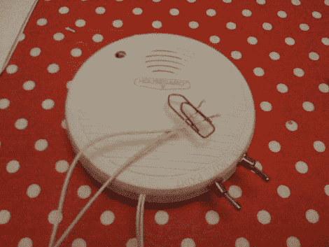

# 用一个旧的烟雾报警器挫败强盗。

> 原文：<https://hackaday.com/2010/02/28/thwart-robbers-with-an-old-smoke-alarm/>

【安德斯】向我们透露了他将烟雾报警器改装成防盗报警器的秘密。不幸的是，他在一次入室盗窃中回家，但他想在下一次有人试图闯入时做好准备。通过巧妙地将测试按钮接入一个旧的烟雾探测器，他创造了一个电路跳闸报警器。每根金属丝的一边都固定在窗框上。一个回形针夹住两根裸露的导线就完成了电路。如果车窗打开，连接会断开，警报会响起。

我们发现这个系统存在一些问题。首先， **千万不要黑掉你唯一的烟雾探测器，你这样做是在拿生命冒险** 。但是[安德斯]说他会有一个替换探测器，因为这些东西大约每十年就需要更换一次，所以你很可能会发现一个旧的还在使用。我们建议伪装这个箱子，这样人们就不会混淆它是一个烟雾探测器。其次，他把警报器安装在窗框上，所以入侵者很可能会把它砸得粉碎。

无论如何，这仍然是对这些无处不在的救生设备的有趣的再利用。