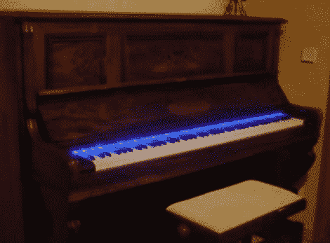

# 极端钢琴移植

> 原文：<https://hackaday.com/2010/02/28/extreme-piano-transplant/>

我们总是想知道当内部不能再保持可演奏状态时，古代钢琴会发生什么。[Jean Philippe Roch] [剖开他年迈的身体，将一只 Korg Triton 放入其中](http://www.youtube.com/user/Proximasolaris)。休息之后，你可以观看一些视频，包括工作日志的幻灯片。[Jean]将 Korg 键盘从其外壳中分离出来，并将其放入空的立式钢琴架中。然后，他将 Korg 的控制器安装在前面板上，并添加了电动控制器，以揭示这个隐藏的秘密。该项目是在直立和蓝色 LED 灯光效果的底部扬声器完成的。

结果是一个相当不错的展示品。它不像[voocoding](http://hackaday.com/2009/10/05/vocoding-with-a-piano/)那么粗糙，但我们真的很喜欢完成后的样子。

 <https://www.youtube.com/embed/0N4XacwfD5Y?version=3&rel=1&showsearch=0&showinfo=1&iv_load_policy=1&fs=1&hl=en-US&autohide=2&wmode=transparent>

 
施工日志
 <iframe class="youtube-player" width="800" height="480" src="https://www.youtube.com/embed/bJhPJaRRcns?version=3&amp;rel=1&amp;showsearch=0&amp;showinfo=1&amp;iv_load_policy=1&amp;fs=1&amp;hl=en-US&amp;autohide=2&amp;wmode=transparent" allowfullscreen="true" style="border:0;" sandbox="allow-scripts allow-same-origin allow-popups allow-presentation"/> 
案例自动化
 <iframe class="youtube-player" width="800" height="480" src="https://www.youtube.com/embed/TNwd5P2LrTM?version=3&amp;rel=1&amp;showsearch=0&amp;showinfo=1&amp;iv_load_policy=1&amp;fs=1&amp;hl=en-US&amp;autohide=2&amp;wmode=transparent" allowfullscreen="true" style="border:0;" sandbox="allow-scripts allow-same-origin allow-popups allow-presentation"/> 
播放演示
 
[谢谢 poisoMike]
 </body> </html>