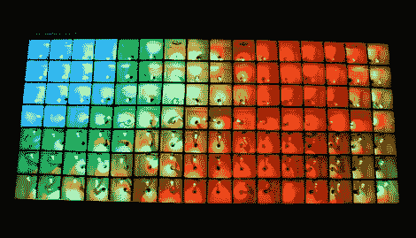

# 112 LED 茶几

> 原文：<https://hackaday.com/2010/02/28/112-led-coffee-table/>

[乔]向我们透露了他的 [112 LED 茶几](http://www.arduino.cc/cgi-bin/yabb2/YaBB.pl?num=1266369410/0)。这个 12 升[的 LED 矩阵](http://hackaday.com/2010/02/26/10x10-led-matrix/)从周五开始，31 升[的 Shiftbrite 表](http://hackaday.com/2010/02/25/shiftbrite-coffee-table/)。驱动[这个网格](http://i50.tinypic.com/33nxapf.jpg)是一个 i2c 从模式的 ATmega328。它侦听来自第二个 ATmega328 的显示数据，并使用这些数据来适当地设置 [TLC5940](http://focus.ti.com/docs/prod/folders/print/tlc5940.html) 驱动的 led 阵列。将处理微控制器与显示微控制器分开允许在中断后可以看到快速和平滑的显示变化。[Joe's] table 展示了精致的电缆管理、简洁的代码和惊人的灵活性。也许[Caleb Kraft](http://hackaday.com/author/calebkraft/)最终会拿出钱来为他自己的家建造这个项目。

[Joe]等到他看到一些其他 LED 表时，才给我们发送他的黑客链接。这显然是一个令人敬畏的项目，一个我们和我们的读者一样想看到的项目。所以，请不要等着别人偶然发现你的项目，[一旦你完成了](http://hackaday.com/contact-hack-a-day/)[分享细节](http://hackaday.com/2009/09/19/how-to-make-your-project-an-internet-sensation/)就给我们发个提示。

 <https://www.youtube.com/embed/Tj1j1-dIX6k?version=3&rel=1&showsearch=0&showinfo=1&iv_load_policy=1&fs=1&hl=en-US&autohide=2&wmode=transparent>

 </body> </html>