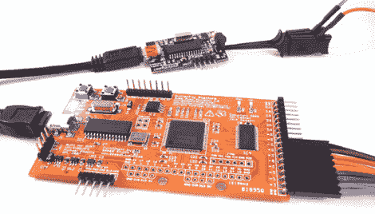

# 开源逻辑分析仪

> 原文：<https://hackaday.com/2010/02/28/open-source-logic-analyzer-2/>

Hackaday 的校友[Ian Lesnet]一直在与一个专门的开发团队合作开发 [OpenBench 逻辑嗅探器](http://www.gadgetfactory.net/gf/project/butterflylogic/)。这种无外壳逻辑分析仪可以工作在 100MHz，一次采样 32 个通道。更好的是，一个附加的[数字示波器](http://dangerousprototypes.com/2010/01/07/open-source-digital-sampling-oscilloscope/)正在工作中。[预购](http://www.seeedstudio.com/depot/preorder-open-workbench-logic-sniffer-p-612.html?cPath=75)售价 45 美元，只需几美元就能拥有很多功能。我们在休息后嵌入了一个演示视频，详细介绍了在 Ubuntu 下安装和使用这款设备。

[https://www.youtube.com/embed/CQ1lHrEnVFU?version=3&rel=1&showsearch=0&showinfo=1&iv_load_policy=1&fs=1&hl=en-US&autohide=2&wmode=transparent](https://www.youtube.com/embed/CQ1lHrEnVFU?version=3&rel=1&showsearch=0&showinfo=1&iv_load_policy=1&fs=1&hl=en-US&autohide=2&wmode=transparent)

【感谢无人机 via [危险原型](http://dangerousprototypes.com/2010/02/25/prototype-open-logic-sniffer-logic-analyzer-2/)