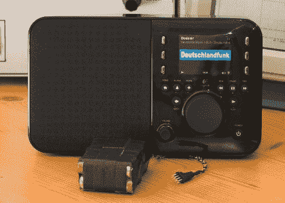

# 带串行接口的便携式挤压箱

> 原文：<https://hackaday.com/2010/03/02/portable-squeezebox-with-serial/>

Squeezbox 媒体流系统是一个小巧的支持 Linux WiFi 的收音机，只要你附近有交流或 USB 插座，你就可以在任何地方播放你的收藏。但是[阿希姆·萨克]想从任何地方[无线传输他的收藏](http://cms.diodenring.de/de/electronic/microcontroller/92-squeezebox)(T2 翻译)。一些戳和刺激揭示了一个连接器实际上是为电池和串行设计的，但还没有商用电池。

该系统需要一个温度传感器，如果你想要串行接口，还需要一个 USB 转换器，但总的来说，这是一个简单的过程，一个下午就可以完成。让你的盒子有大约 10 个小时的寿命，甚至可以放在后车厢里。

[谢谢托马斯]