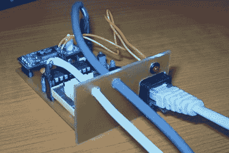

# 自动电话录音机

> 原文：<https://hackaday.com/2010/03/02/automatic-telephone-recorder/>

[詹姆斯·邦德]患有严重妄想症的人现在可以记录所有的电话对话。[Trax]建立了[这个模块监控电话线，并在拿起听筒时开始记录](http://www.elektronika.ba/746/phone-recorder/)。微控制器通过 USB 连接触发计算机进行实际记录。

我们喜欢使用旧的印刷电路板作为面板，我们当然有一些自己的哑弹坐在周围。这三根线有点混乱。一个用于电话线，一个用于 USB，但第三个是做什么的？这是音频输出连接吗？

我们已经要求[Trax]发布一个原理图和源代码，如果可能的话，这样可能会消除这个谜。

**更新:** [Trax]让我们知道有一个红色按钮，底部有白色字体，标着“下载”。这包括原理图、代码、pcb 布局和 PC 软件。我们只是第一次错过了。