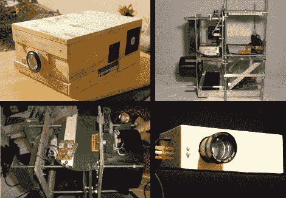

# DIY 投影仪收藏

> 原文：<https://hackaday.com/2010/03/04/diy-projector-collection/>

读者[Jan]偶然发现了一个关于[打造自己的视频投影仪](http://www.allinbox.com/allinbox2010.htm)的网站。我们已经链接了 2010 年的五个最佳项目，但是如果你挖掘得更深一点，还有更多的信息。到目前为止，我们最喜欢的是 [GohtanBox v3](http://www.allinbox.com/GohtanBox3/GohtanBox3.htm) ，它的巨大 LED 面板充当投影灯。