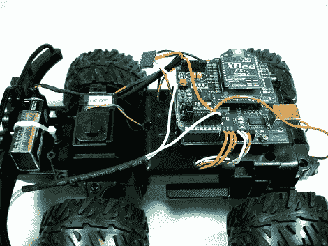

# 机器人平台的遥控卡车来源

> 原文：<https://hackaday.com/2010/03/05/rc-truck-source-for-robotics-platform/>

[迈克尔]给我们发了一个他的遥控机器人平台的链接。他从与 [iPhone 机器人(汽车)](http://hackaday.com/2009/12/05/remote-controlled-robot-car-vs-solar-charged-tank/)相同的遥控玩具开始，但以等待更多功能的空白状态结束。他有一个 Arduino，带有一个电机驱动器，三个前后颠簸开关，以及一个 XBee 模块。另一方面，他使用 SparkFun USB 转 FTDI 连接器将另一个 XBee 模块与 PC 连接，以便使用[处理](http://processing.org/)。

在休息后的剪辑中，你可以看到电机控制需要进行更多的微调，以便野兽在奔跑时不会失控。但是这里有巨大的潜力。从设备添加至少基本的视频反馈应该不成问题。Arduino 目前只被少量使用，留下了足够的空间来添加机载感应，如红外、接近或光线。

这是一个干净的开始，我们期待看到更新！

[https://player.vimeo.com/video/8937750](https://player.vimeo.com/video/8937750)