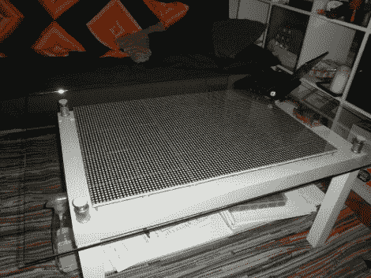

# 发光二极管侵入茶几缝隙

> 原文：<https://hackaday.com/2010/03/08/leds-invade-coffee-table-crevice/>

有很多发光二极管，还有一点玻璃清洁剂。[Tobias] [为他的宜家咖啡桌增添了 6144 个 led 灯](http://tobiscorner.floery.net/projects/avr/arduino-ikea-coffee-table-hack/199)。这是使用 64 个 8×8 模块的 [SparkFun 的 LED 茶几](http://hackaday.com/2008/09/13/led-coffee-table/)的更大实现。[Tobias]从 Sure Electronics 采购了三块[显示板，总共 96 个 8×8 模块。这些板通过串行接口寻址；每个电路板有四条串行线，但每个行选择引脚和数据/锁存/时钟引脚有一条共享数据总线。这种方法使用 Arduino 上驱动显示器的 20 个引脚中的 19 个。休息之后，你可以看到一个演示。如果这比你需要的更多，总有](http://www.sureelectronics.net/goods.php?id=419) [112-LED](http://hackaday.com/2010/02/28/112-led-coffee-table/) 和 [81-LED](http://hackaday.com/2010/02/25/shiftbrite-coffee-table/) 表项目可以产生一个完整的颜色范围。

 <https://www.youtube.com/embed/x7-wtJGhpzE?version=3&rel=1&showsearch=0&showinfo=1&iv_load_policy=1&fs=1&hl=en-US&autohide=2&wmode=transparent>

 <iframe class="youtube-player" width="800" height="480" src="https://www.youtube.com/embed/kXHrMa2NvqM?version=3&amp;rel=1&amp;showsearch=0&amp;showinfo=1&amp;iv_load_policy=1&amp;fs=1&amp;hl=en-US&amp;autohide=2&amp;wmode=transparent" allowfullscreen="true" style="border:0;" sandbox="allow-scripts allow-same-origin allow-popups allow-presentation"/> <iframe class="youtube-player" width="800" height="480" src="https://www.youtube.com/embed/0Bu621bRCZ8?version=3&amp;rel=1&amp;showsearch=0&amp;showinfo=1&amp;iv_load_policy=1&amp;fs=1&amp;hl=en-US&amp;autohide=2&amp;wmode=transparent" allowfullscreen="true" style="border:0;" sandbox="allow-scripts allow-same-origin allow-popups allow-presentation"/> </body> </html>