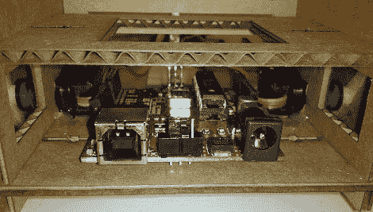

# 纸板机器人

> 原文：<https://hackaday.com/2010/03/08/cardboard-androids/>

当纸板和 Android 手机以更低的成本工作得更好时，谁还需要昂贵的基于丙烯酸的微控制机器人呢？Cellbots 的团队已经做到了这一点。虽然他们确实作弊了一点，使用激光切割纸板进行精确测量，并包括一个 Arduino 来控制伺服系统，但他们肯定达到了“便宜”的目标(假设他们已经有了手机)。我们只是想知道为什么他们花了 **4 周**来完成一点点 [CAD](http://code.google.com/p/cellbots/source/browse/#svn/trunk/CAD/truck) 和[代码](http://code.google.com/p/cellbots/)。

不管怎样，我脑海中立即浮现的一个想法是:成千上万 数百一些小纸板[虫群机器人](http://hackaday.com/2008/12/30/25c3-cheap-swarm-robotics/)到处破坏房屋，只是不要踩它们。

[感谢 [Mashable](http://mashable.com/2010/03/06/cellbot/)