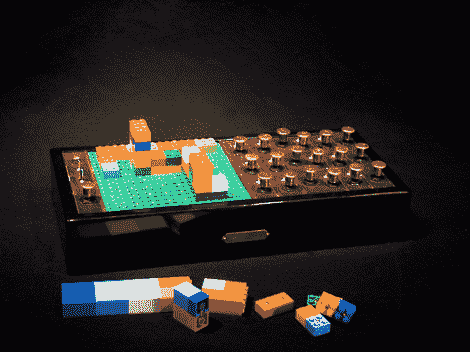

# 乐高音序器构建 3D 声音

> 原文：<https://hackaday.com/2010/03/09/lego-sequencer-builds-sound-in-3d/>

[Yoshi Akai]制造了一个部分是蒸汽朋克，部分是注射成型塑料的音序器。LEGO sequencer MR II 在一个循环中有八个步骤，通过将彩色块添加到绿色基板上来操纵。每种颜色对应一种特殊的声音，这种声音可以通过向天空的建筑来改变。另一方面，他为旋钮和开关添加了一个制作精美的控制区域。我们没有看到太多关于设备内部的信息，所以，休息后观看剪辑，然后在评论中随意开始猜测。

这是一个类似于[硬币排序器](http://hackaday.com/2009/10/15/turntable-sequencer-scratches-with-coins/)的概念。从上面的图片看，这些积木似乎被改变了，也许[用光来识别不同的积木](http://hackaday.com/2010/01/21/turntable-light-sequencer/)。

 <https://www.youtube.com/embed/3AontRDPQj0?version=3&rel=1&showsearch=0&showinfo=1&iv_load_policy=1&fs=1&hl=en-US&autohide=2&wmode=transparent>

 
[感谢 Fuzzthed via <a href="http://blogs.westword.com/backbeat/2010/03/lego_sequencer_builds_sound_fr.php" target="_blank"> Westword </a>
 </body> </html>