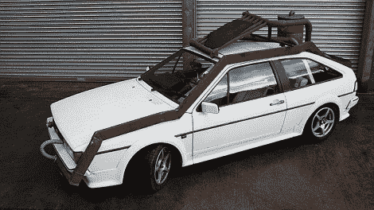

# 咖啡动力汽车-普奇诺

> 原文：<https://hackaday.com/2010/03/10/coffee-powered-car-puccino/>

我们只能想象这辆燃烧咖啡的汽车以最高 60 英里的时速在高速公路上行驶时有多难闻。不要急着从座位上跳起来找自己的座位，虽然这个想法听起来很棒，但里程数会让你很快回到现实。每公斤咖啡 3 英里，它可以将 36 210 英里的旅程变成 910 到 1820 英里，每半小时停下来重新加满咖啡豆！

尽管如此，汽车-普契诺是一个惊人的转换，我们越来越接近回到未来的[融合先生](http://hackaday.com/2010/03/04/is-gek-a-modern-day-mr-fusion/)

[谢谢蒂姆]