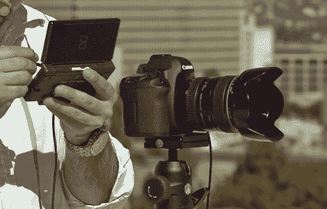

# 更新:任天堂 DS 相机控制

> 原文：<https://hackaday.com/2010/03/11/update-nintendo-ds-camera-control/>

从你的任天堂 DS 上控制相机所需的所有有趣的细节现在都可以在[开放相机控制项目](http://www.hdrlabs.com/occ/index.html)中获得。这是几年前设置的【曹思德的】[的后代。该系统已经过改进，增加了许多功能。它已被用于电影制作，并与各种各样的相机配合使用。](http://hackaday.com/2008/09/17/control-your-camera-remotely-with-a-ds/)

从[使用运行 Arduino 引导程序的 AVR 微控制器构建自己的接口电缆](http://www.hdrlabs.com/occ/hardware.html)开始。最后由[加载一些开源软件](http://www.hdrlabs.com/occ/software.html)到 DS 上，以增加大量的拍摄选项。

[谢谢波普斯·麦克格鲁德]