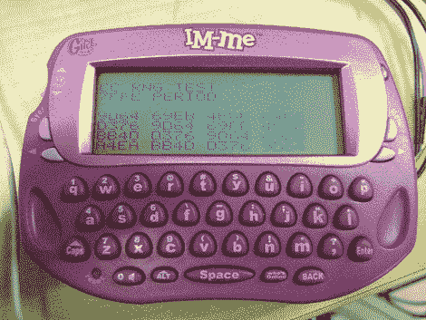

# 简易即时消息闪烁

> 原文：<https://hackaday.com/2010/03/12/easy-im-me-flashing/>

[Travis Goodspeed]写了一个为 IM 更新固件的指南。他正在使用他设计的一个 [GoodFET 开源 JTAG 适配器](http://goodfet.sourceforge.net/)来进行编程。这实际上是在设备上进行[戴夫的][T4 的]工作，并运行它。最终目标是为设备开发一个操作系统。如果你没有读过以前的文章，一旦被黑，这就变成了一个用于 [Chipcon CC1110](http://focus.ti.com/docs/prod/folders/print/cc1110f32.html) 处理器的开发板，包括键盘、LCD 屏幕和无线通信。