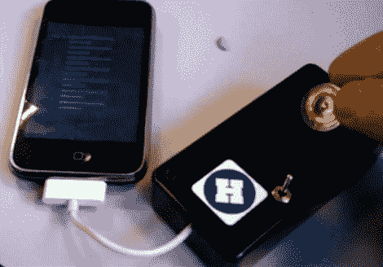

# IPhone 的 RFID 阅读器

> 原文：<https://hackaday.com/2010/03/14/rfid-reader-for-iphone/>

[本杰明·布伦德尔]为 iPhone 制造了一个 RFID 阅读器。一台[越狱的 iPhone](http://hackaday.com/2010/03/11/hardware-jailbreak-eases-reboot-pains/) 通过接入标准的 iPhone USB 电缆连接到这个项目箱。就像在[过去的 iPhone 系列项目](http://hackaday.com/2010/02/15/developing-for-iphone-serial-communications/)，【Benjamin】使用 openFrameworks 作为软件界面。目前，这款阅读器只能检测低频标签，但他正在研究读取 MIFARE 标签的代码。休息后，请观看视频中屏幕上显示的标签 ID 的魔力。

<https://player.vimeo.com/video/10133832>

 
[感谢 Andrew via <a href="http://recombu.com/news/how-to-make-your-own-iphone-rfid-reader_M11544.html" target="_blank"> Recombu </a>
 </body> </html>