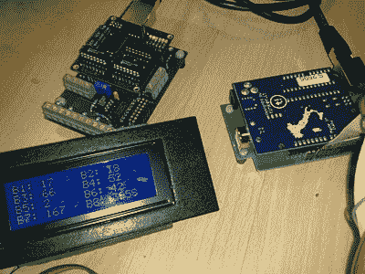

# 不用 OBD-II 就能监视你的车

> 原文：<https://hackaday.com/2010/03/16/keep-tabs-on-your-car-without-obd-ii/>

[Steve]让我们了解一下他的[多显示器汽车监控系统](http://code.google.com/p/multidisplay/)。与依赖与 OBD-II 协议和现有汽车计算机接口的[传统系统](http://hackaday.com/?s=obd-II)不同，MultiDisplay 使用 Arduino 和[定制屏蔽](http://code.google.com/p/multidisplay/wiki/Build_a_Kit)以及传感器组合；包括温度、压力、节流、增压等。然后，收集的数据可以显示在 20×4 LCD 上，或者传输到具有可视化和事件记录功能的 PC。

很高兴看到半年的工作终于完成，并以如此干净和专业的方式呈现，继续努力[史蒂夫]