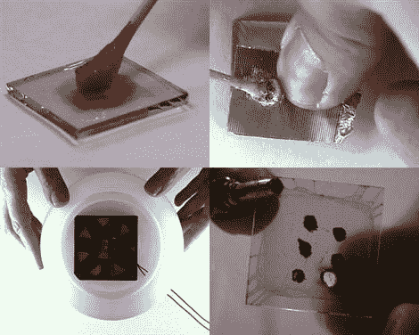

# 制作自己的 OLEDS

> 原文：<https://hackaday.com/2010/03/17/make-your-own-oleds/>

威斯康星大学正在举办一场关于如何自制有机发光二极管的辅导课。这真是太棒了。我们想让你们做一些。有人制作你自己的矩阵，在上面展示一些图案，然后提交。求你了。虽然我们已经看到了有机发光二极管屏幕的许多用途，但我们从未真正深入研究过创建它们的过程。它看起来没有我们想象的那么复杂。

[via [MakeZine](http://blog.makezine.com/archive/2010/03/diy_organic_leds.html)