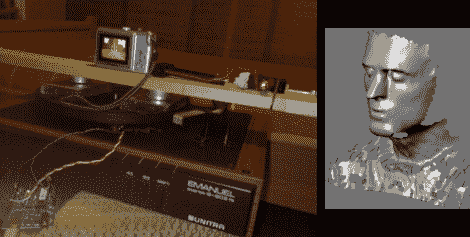

# 扔掉 LPs，建造你自己的 3D 扫描仪

> 原文：<https://hackaday.com/2010/03/18/ditch-the-lps-and-build-your-own-3d-scanner/>

给自己找一个旧的唱机、一个激光水平仪和一个数字扫描仪，你就可以[建造一个 3D 扫描仪](http://en.myinventions.pl/index.php?page=3Dscanner)。这就是[罗布]所做的。摄像机和激光水平仪安装在转盘上，以便稳定旋转。摄像机通过以 640×480 的分辨率记录 30 fps 来捕捉在房间内传播的垂直激光线。这些数据然后通过 Python 脚本和 [Python 图像库](http://www.pythonware.com/products/pil/index.htm)被翻译成 [Blender 3D](http://www.blender.org/) 文件。你可以扫描整个房间或者只是一个小物体。上面这张脸是这张图片经过一些处理后的结果。[Rob]发现这在黑暗中以及扫描无反射表面时效果最佳。

确保你也检查了[相机和投影仪扫描方法](http://hackaday.com/2009/12/30/update-realtime-3d-for-you-too/)。