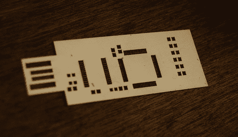

# 激光切割焊接模板

> 原文：<https://hackaday.com/2010/03/19/laser-cutting-solder-stencils/>

你有激光切割机吗？如果是这样，你可以使用[莱利·波特的]方法[切割你自己的焊接模板](http://blog.synthetos.com/how-to-make-an-eagle-solder-mask-stencil-for-an-laser-cutter/)。他从 Eagle 文件开始，将 Dimension 和 tCream 层导出为 PDF。然后使用 Ghostwriter、Gview 和 Corel draw 处理该文件。结果是一个 1200dpi 的文件输入到您的 Epilog 激光器。现在你已经准备好在焊膏和[上](http://hackaday.com/2009/10/13/how-to-populate-a-surface-mount-pcb/)[模板来填充 PCB](http://hackaday.com/2009/02/17/sparkfun-stencil-and-solder-paste-class-notes/) 。

[谢谢[特拉维斯·古斯比](http://travisgoodspeed.blogspot.com/)