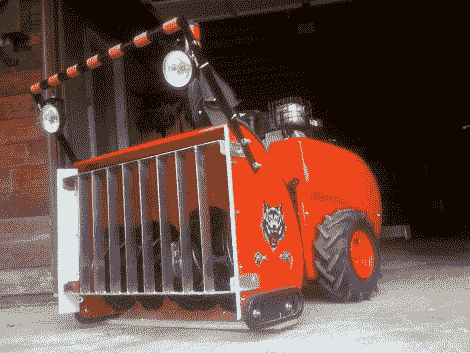

# 机器人鼓风机肯定会成为斯蒂芬·金小说

> 原文：<https://hackaday.com/2010/03/20/robo-blower-sure-to-become-stephen-king-novel/>

除雪和洗衣服一样被列为最不喜欢的家务活之一。[赫伯·斯潘塞]试图将这个过程自动化，同时通过建造一个机器人吹雪机来吓唬他的邻居。重型起重仍然是由一个气体发动机推动雪螺旋钻。两节电池为电气系统供电，该系统从遥控器接收命令，移动表演滑道并管理导航。他在安全方面做了力所能及的事情，在前面增加了一个壁炉，顶部有闪光灯，一个操作员控制的喇叭，以及杀死电路(关闭它，而不是杀死不知情的人)。所有这些都被包装在一个漂亮的包里，特别是与上个月的[吹雪机推平台](http://hackaday.com/2010/02/01/snow-blower-robot/)相比。

也许明年他会致力于让它变得自主？休息过后，看看机器人鼓风机清理车道。

 <https://www.youtube.com/embed/S3i_5yue-Qw?version=3&rel=1&showsearch=0&showinfo=1&iv_load_policy=1&fs=1&hl=en-US&autohide=2&wmode=transparent>

 
【感谢胡安 via <a href="http://hackedgadgets.com/2010/03/19/robo-blower-remote-controlled-snow-blower/" target="_blank">被黑的小工具</a>
 </body> </html>