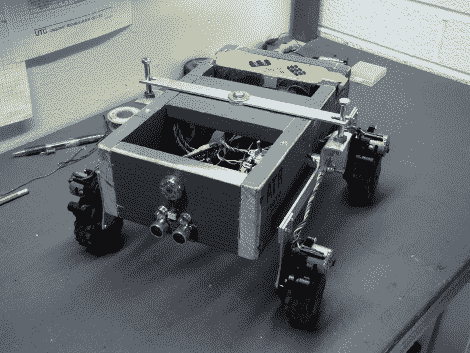

# 全地形 Roomba

> 原文：<https://hackaday.com/2010/03/23/all-terrain-roomba/>

这辆小漫游车在崎岖的地形上行驶得很好。Dean Segovis 用 Roomba 的零件建造了它。Roomba 使用车轮和变速箱来处理这个原型运行中的大量脏活。[院长]抓住其中的四个，以及电机控制器板和面糊，并安装在这个[摇臂-转向架悬挂](http://en.wikipedia.org/wiki/Rocker-bogie)。在休息后的视频中，他提到如果击球手重新定位到身体的中心，这将是一个非常好的攀岩者。超声波传感器增加了避障功能，Arduino 负责处理过程。我们迫不及待地想看到未来版本的[Roomba 的](http://hackaday.com/2010/03/05/google-your-home-with-a-roomba/)混战户外表弟。

 <https://www.youtube.com/embed/xrPBWtjbHKs?version=3&rel=1&showsearch=0&showinfo=1&iv_load_policy=1&fs=1&hl=en-US&autohide=2&wmode=transparent>

 
[通过<a href="http://blog.makezine.com/archive/2010/03/roomba-bashing_for_bot_parts.html" target="_blank">使</a>
 </body> </html>