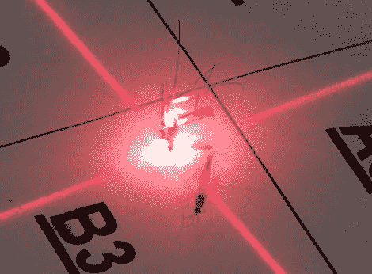

# 吸血鬼之死——皮尤皮尤

> 原文：<https://hackaday.com/2010/03/23/die-bloodsuckers-pew-pew/>

为了抗击疟疾，Intellectual Ventures 正在开发一种用激光杀死蚊子的方法。该系统被称为光子围栏，通过它们拍打翅膀的频率来识别动物(嘿，这正是我们如何知道它们何时俯冲轰炸我们的头部)。一旦被锁定，肮脏的吸血鬼就死定了。

这个故事在 2009 年中期被新闻来源抓住了。从那以后，开发团队在他们的网页上添加了一些非常有趣的信息。去年二月，一些蚊子飞行的视频被上传。这些照片是使用特别设计的摄影设备以 6000 fps 拍摄的(可能[很像这个](http://hackaday.com/2008/12/27/in-flight-insect-photo-rig/))，以确保镜头对焦。现在他们[被安排在 2010 年 ted 大会](http://intellectualventureslab.com/?p=842)上发表演讲。这些谈话的发表有时会滞后几个月，所以请耐心等待。休息后观看视频，获得一些正在使用的硬件的抽象镜头；在会议之前他们不会放弃货物。

[https://www.youtube.com/embed/O9RAvAA798c?version=3&rel=1&showsearch=0&showinfo=1&iv_load_policy=1&fs=1&hl=en-US&autohide=2&wmode=transparent](https://www.youtube.com/embed/O9RAvAA798c?version=3&rel=1&showsearch=0&showinfo=1&iv_load_policy=1&fs=1&hl=en-US&autohide=2&wmode=transparent)

[谢谢胡安]