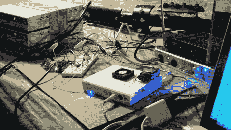

# 迪吉里杜管，现在做实时视频

> 原文：<https://hackaday.com/2010/03/23/didgeridoo-now-does-real-time-video/>

你们中的一些人可能还记得，当我们向你们介绍电子改造的迪吉里杜管时。这些成员知道他仍然在玩他的迪吉里杜管，现在包括[实时视频处理](http://yaktronix.blogspot.com/2010/03/electronically-modified-didgeridoo.html)，他们的心会温暖。除了它由 ATMega168 和一个未知的模拟开关芯片控制之外，没有太多的细节，在它的初期，它看起来只是一堆跳舞的白线，但我们希望这能变成一个令人惊叹的显示器。

哦，那些决定自己制作电子改良迪吉里杜管的人应该留意一下 4 月 10 日的《大众科学》杂志，这种乐器将会在那里展出。