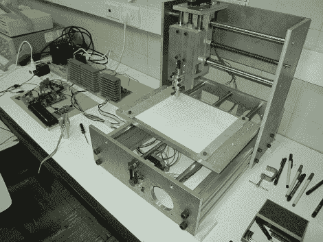

# 基于 ARM 的数控铣床不需要计算机

> 原文：<https://hackaday.com/2010/03/24/arm-based-cnc-mill-needs-no-computer/>

[Fedeortiz12]和他的团队正在[接近完成他们的数控轧机](http://makeitcnc.wordpress.com/) ( [英文翻译](http://translate.google.com/translate?js=y&prev=_t&hl=en&ie=UTF-8&layout=1&eotf=1&u=http%3A%2F%2Fmakeitcnc.wordpress.com%2F&sl=es&tl=en))。他们着手建造一台独立的机器，从 SD 卡中获取 RS274/NGC 格式的 [G 代码](http://en.wikipedia.org/wiki/G-code)，并相应地加工零件。该系统的核心是 ARM LPC2148 控制器，带有字符 LCD 和操作控制板。这些人制作了一个挑逗性的视频，展示了用毡尖笔测试的项目。休息之后看一下。

我们希望看到铣削 PCB 的最终产品。我们总是有点嫉妒[imsolidstate]在他店里的 [PCB 铣削设置](http://www.imsolidstate.com/archives/476)。

 <https://www.youtube.com/embed/BXhu94fYWDg?version=3&rel=1&showsearch=0&showinfo=1&iv_load_policy=1&fs=1&hl=en-US&autohide=2&wmode=transparent>

 </body> </html>