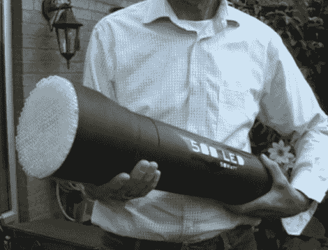

# 那是一个大手电筒

> 原文：<https://hackaday.com/2010/03/26/thats-a-big-flashlight/>

去露营吗？你需要一个额外的背包来携带这个手电筒。在商用端，你会发现 500 个 5 毫米的超高亮白色 led，在另一端，你会发现手电筒上的控制数量是你预期的 10 倍。在全功率下，LED 阵列降低了 50 瓦，这让我们质疑该设备的电池寿命。休息之后，请观看排练。led 安装在原型板上，有利于一些极端的点对点焊接。在控制演示过程中，有一种背景噪音，就像一架喷气式飞机正在加速，这是怎么回事？

虽然这个了不起的火炬让我们笑逐颜开，但我们想知道它作为车载照明器是否会做得更好。或者，如果一个微控制器被扔进混合物中，一些创造性的代码可以使它成为一个相当强大的非致命武器。

 <https://www.youtube.com/embed/NkkU0UO3sek?version=3&rel=1&showsearch=0&showinfo=1&iv_load_policy=1&fs=1&hl=en-US&autohide=2&wmode=transparent>

 
[谢谢克里斯]
 </body> </html>