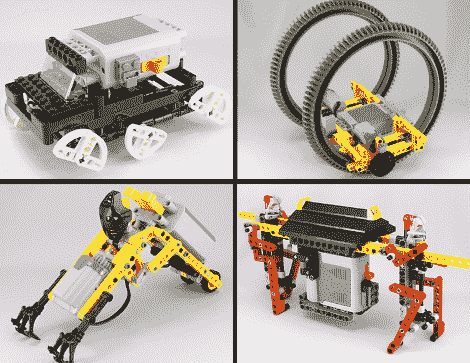

# 乐高机器人

> 原文：<https://hackaday.com/2010/03/26/lego-automatons/>

这里有一组古怪的乐高玩具。其中一些展示了一个目的，比如这个有趣的关于[一个循线机器人](http://www.isogawastudio.co.jp/legostudio/modelgallery_model/a043.html)。其他的，像上面看到的四个，只是机器人，通过它们的运动让你的脸上露出笑容。有几十种可供选择，每种都有几张图片和一段视频。休息后看这四个的片段。哦，别担心，我们没有找到任何[乐高](http://hackaday.com/2009/09/15/rotating-lego-dock-take-two/) [iPhone 坞](http://hackaday.com/2009/09/09/rotating-iphone-dock-from-legos/)，只是 [cleaver 移动创作](http://hackaday.com/2010/02/10/picaxe-lego-tank/)。

[https://www.youtube.com/embed/Zd8MF-CVtns?version=3&rel=1&showsearch=0&showinfo=1&iv_load_policy=1&fs=1&hl=en-US&autohide=2&wmode=transparent](https://www.youtube.com/embed/Zd8MF-CVtns?version=3&rel=1&showsearch=0&showinfo=1&iv_load_policy=1&fs=1&hl=en-US&autohide=2&wmode=transparent)

[https://www.youtube.com/embed/8ZKZQkE52Cg?version=3&rel=1&showsearch=0&showinfo=1&iv_load_policy=1&fs=1&hl=en-US&autohide=2&wmode=transparent](https://www.youtube.com/embed/8ZKZQkE52Cg?version=3&rel=1&showsearch=0&showinfo=1&iv_load_policy=1&fs=1&hl=en-US&autohide=2&wmode=transparent) [https://www.youtube.com/embed/hDg67_q87Ro?version=3&rel=1&showsearch=0&showinfo=1&iv_load_policy=1&fs=1&hl=en-US&autohide=2&wmode=transparent](https://www.youtube.com/embed/hDg67_q87Ro?version=3&rel=1&showsearch=0&showinfo=1&iv_load_policy=1&fs=1&hl=en-US&autohide=2&wmode=transparent) [https://www.youtube.com/embed/_-FrJ16eV1s?version=3&rel=1&showsearch=0&showinfo=1&iv_load_policy=1&fs=1&hl=en-US&autohide=2&wmode=transparent](https://www.youtube.com/embed/_-FrJ16eV1s?version=3&rel=1&showsearch=0&showinfo=1&iv_load_policy=1&fs=1&hl=en-US&autohide=2&wmode=transparent)

[谢谢理查德和胡安]