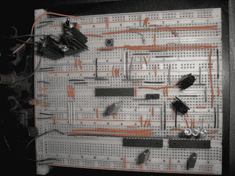

# 带无线运动控制器的 8 位游戏控制台

> 原文：<https://hackaday.com/2010/03/26/8-bit-game-console-with-wireless-motion-controller/>

[路易斯·克鲁斯]建造了一个带运动控制的游戏控制台。上面的电路通过复合视频连接到电视，并与无线控制器通信。控制器位于一个较小的试验板上，该试验板包括用于输入的加速度计和将无线数据传输回家庭系统所需的红外电路。休息之后看看视频里他为它开发的第一个游戏。有一些可用的细节(即:他使用 ATmega168 和 ATmega328 芯片)，但我们要求他张贴代码和原理图，他目前正在清理大规模消费。

啊，那个游戏里的 8 位声音把我们带回了 [Atari](http://hackaday.com/2009/12/16/2600-game-jukebox/) 和 Intellivision 的光辉岁月。

 <https://www.youtube.com/embed/B7zokCnJdfc?version=3&rel=1&showsearch=0&showinfo=1&iv_load_policy=1&fs=1&hl=en-US&autohide=2&wmode=transparent>

 </body> </html>