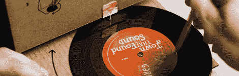
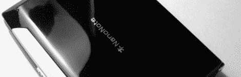
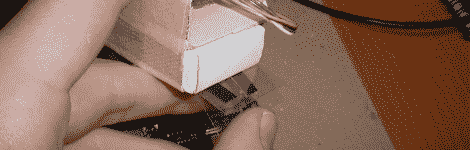
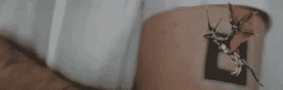

# 黑客日链接:2010 年 3 月 28 日

> 原文：<https://hackaday.com/2010/03/28/hackaday-links-march-28-2010/>

**纸板唱机**

[Yen]向我们透露了这个纸板唱机的消息。这是一个营销工具，你会收到邮件。纸板包装里面是一张唱片，包装本身可以折叠成一个播放器。

**可黑客攻击的手持设备**

NanoNote 是一款小巧的手持设备，价格低廉，功能强大。它运行 [openWRT](http://openwrt.org/) ，配备全键盘、336MHz 处理器、32 MB 内存和 2 GB 闪存。对于 99 美元来说还不错。[感谢无人机通过 [Linux 设备](http://www.linuxfordevices.com/c/a/News/Qi-Hardware-Ben-NanoNote/)

**虚拟翻页物理界面**

****

喜欢阅读电子书，但错过了翻阅页面？[Marcin Szewczyk] [开发了这个界面](http://wodny.org/special/glbook_plasticpage/),它可以让你翻动几张塑料纸，在屏幕上翻页。

**增强现实 tat**

****

对支持一个水墨艺术家不感兴趣或者只是不能决定设计？也许你应该[在你的手臂上纹一个增强现实标记](http://www.youtube.com/watch?v=6XSB70J6a98),并为那些已经放弃使用纯模拟眼睛的人添加数字艺术。【感谢 DETN8R via [庇护](http://www.asylum.com/2010/03/03/rock-a-bitchin-3-d-tat-with-a-little-ar/)

**用 CPU 做饭**

****

[Bo3bo3]正在用处理器练习烹饪艺术，但他把事情提升了一个档次。T2 没有在电脑机箱里做饭，而是把处理器从主板上拆下来，用 USB 供电。[谢谢瓦西姆]