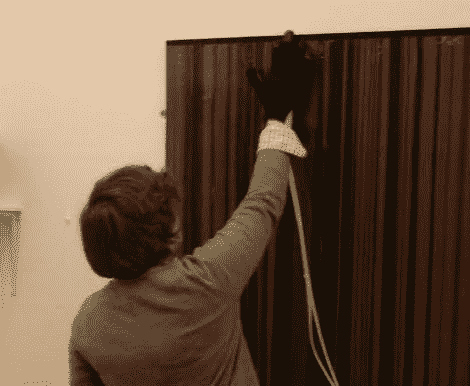

# 模拟磁带游戏手套

> 原文：<https://hackaday.com/2010/03/30/analog-tape-playing-glove/>

录音带中的磁带玩起来会很有趣。这个装置名为[信噪比](http://signaltonoise1.blogspot.com/)，以手套的形式将卡带播放器的磁头重新定位到你的指尖。一面附带的墙上有垂直的胶带，你可以用指尖沿着它播放存储的音频。把速度调准，你就能看清磁带上的内容。来回移动，你会像最糟糕的 DJ 一样抓痒。

如果这与一个成熟的人合作，将会是一场精彩的演出。休息之后，看看和听听这个奇怪的装置。

 <https://www.youtube.com/embed/abd_2dVdkvI?version=3&rel=1&showsearch=0&showinfo=1&iv_load_policy=1&fs=1&hl=en-US&autohide=2&wmode=transparent>

 
[谢谢奥利]
 </body> </html>