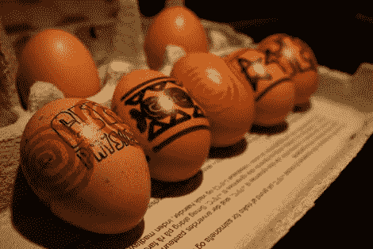

# 数控鸡蛋装饰

> 原文：<https://hackaday.com/2010/03/30/cnc-egg-decorating/>

由于缺乏耐心手工制作，GeekPhysical 制造了一台数控机器来装饰复活节彩蛋。我们指的是用来庆祝基督教复活节的鸡蛋，而不是用来娱乐极客的科技产品中隐藏的[金块。考虑到打印介质既不是完美的圆形也不是完美的光滑，他们在视频中看到的结果(休息后)相当令人印象深刻。硬件设计巧妙；一个伺服系统旋转鸡蛋，另一个安装在鸡蛋的一侧，沿弧线移动轨道，这样毡尖笔就会跟随蛋壳的曲线。通过使用由](http://hackaday.com/2009/10/12/easter-egg-challenge/)[鲍登线缆](http://en.wikipedia.org/wiki/Bowden_cable)物理移除第三伺服机构，笔沿着轨道移入和移出。我们能够通过他们的 [Flickr set](http://www.flickr.com/photos/29889578@N05/sets/72157623604647875/) 更近距离地观察硬件，该设备确实是 Arduino 驱动的。这个有趣的建筑是庆祝这个季节的好方法！

[https://www.youtube.com/embed/dPNILXHLTpA?version=3&rel=1&showsearch=0&showinfo=1&iv_load_policy=1&fs=1&hl=en-US&autohide=2&wmode=transparent](https://www.youtube.com/embed/dPNILXHLTpA?version=3&rel=1&showsearch=0&showinfo=1&iv_load_policy=1&fs=1&hl=en-US&autohide=2&wmode=transparent)