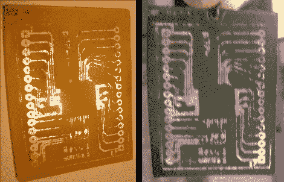

# 任何颜色的自制板

> 原文：<https://hackaday.com/2010/03/31/home-fabricated-boards-in-any-color/>

厌倦了你蚀刻出来的每块棕色印刷电路板？从[戴恩的]书里拿一页纸，把你的印刷电路板染成你想要的任何颜色。在 200 度的 [Rit 染料](http://www.ritdye.com/home.lasso)浴中浸泡一小时后，他的棕色 [FR4](http://en.wikipedia.org/wiki/Fr4) 衬底变成了想要的深绿色。我们给他加分，因为他用一个破瓶子当容器，但同时还戴着眼睛保护装置。

我们从来没有真正想过这样做，但它的工作非常有趣。当[移除蚀刻抗蚀剂](http://hackaday.com/2009/07/13/etch-pcbs-with-ferric-chloride-and-a-sponge/)时，我们已经对基板进行了染色，因此这应该是显而易见的，但却不是。