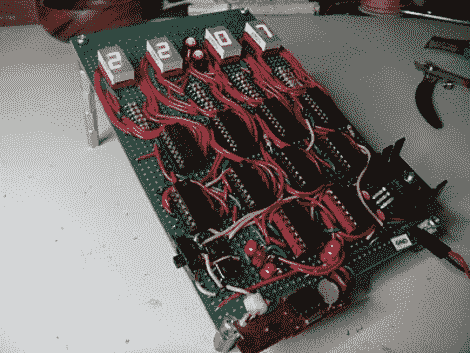

# 无微控制器时钟

> 原文：<https://hackaday.com/2010/04/03/clock-sans-microcontroller/>

这个时钟不需要微控制器。它实际上是一个[数字逻辑计数器，起到时钟](http://www.homebrewtechnology.org/2010/04/digital-clock-7490-decade-counters-and.html)的作用。[BlackCow]使用六个十进制计数器来跟踪秒、分和小时。使用 BCD-7 段解码器，输出显示在四个 7 段数字上，你可以在[我们的二进制编码十进制帖子](http://hackaday.com/2010/01/08/beginner-concepts-binary-coded-decimal/)中了解到。实际的计时是由他从米老鼠时钟中取出的石英钟电路来完成的。这将是一个构建在[数字逻辑模拟器](http://hackaday.com/2008/12/18/7400-series-logic-simulator/)中的完美电路，只需[跟随原理图](http://docs.google.com/fileview?id=0B-kMjjaL8EzpOGVmZmVmZjUtYjA5NC00YTE5LWFiNmQtOWM5MjcyYjFlY2Ji&hl=en)并边走边学。