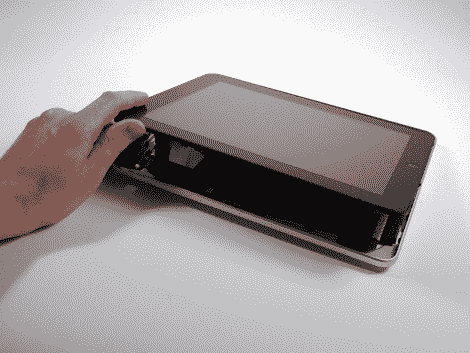

# IPad 拆卸

> 原文：<https://hackaday.com/2010/04/03/ipad-teardown/>

我们已经有一段时间没有展示 iFixit 的东西了。但是当我们看到他们拆开了下一个最伟大的苹果产品，[今天发布的 iPad](http://www.ifixit.com/Teardown/iPad-Teardown/2183/1)–，以及[我们团队的每个人](http://hackaday.com/2010/01/29/our-thoughts-on-the-ipad/) [*多么热爱* it](http://hackaday.com/2010/01/29/our-thoughts-on-the-ipad/) ，我们想为什么不让我们的用户群也享受一下破坏有益的拆卸。

在最初的版本和 [FCC 拆卸版](http://www.ifixit.com/Teardown/iPad-FCC-Teardown/2197/1)中，我们看到了苹果实现的一些令人敬畏的功能和技巧。最值得注意的是两个独立的 3.75V 锂聚合物电池，没有焊接到主板上，允许用户在需要时轻松更换电池。然而，在相反的方面，越来越多的元件被粘合到电路板上，使得 iPad 更加坚固。

我们不禁要问，既然每个人都能看到漂亮的内部，这是否会改变人们购买 iPad 的想法？还是你更愿意[自己做](http://hackaday.com/2010/03/15/eat-your-heart-out-ipad/)？