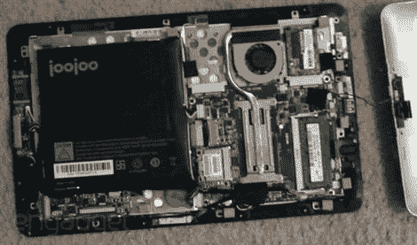

# 珠珠是合法的，被拆了。

> 原文：<https://hackaday.com/2010/04/04/joojoo-turns-out-to-be-legit-gets-torn-down/>

[JooJoo 存在](http://www.engadget.com/2010/04/03/joojoo-ships-to-actual-consumers-gets-dissected-for-good-measur/)。随着最近媒体对 iPad 的报道，我们有机会听到一些有趣的讨论和激烈的辩论。通常越是精通技术的人和黑客越是对硬件和软件的“封闭性”感到不安。我们听说过许多替代方案，但通常都相当笨重。由 [Fusion Garage](https://thejoojoo.com/sites/) 开发的 JooJoo(最初是“crunch pad”)被提及，但我们一直在回避它，因为该公司遇到了如此多的挫折，我们怀疑它是否真的存在。的确如此。他们在 iPad 上市的同时推出了第一批产品。

它有什么特别之处？好吧，这是你打开它时会发现的东西(是的，用螺丝)。

*   提供一个内存插槽，1 GB
*   2 个迷你 pcie 插槽
*   1 个固态硬盘插槽
*   3g sim 卡插槽
*   英伟达的新离子图形芯片
*   凌动 n270 处理器

4 Gb 的存储，蓝牙，wifi，一个**摄像头**，**外部 USB** 端口，一个号称 1366×768 分辨率的屏幕，**支持 flash 的光滑接口**，我们不禁兴奋起来。售价 499 美元。我们认为这可能是一个非常棒的黑客平台。我们还不打算跑出去买一个，但是如果它开始流行，我们希望看到人们疯狂地黑这些东西。太糟糕了，他们不能得到更多一点的压力来与 iPad 竞争。