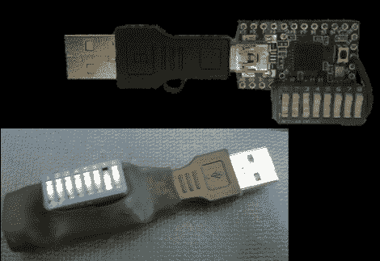

# 编程你自己的造成伤害的 USB 加密狗

> 原文：<https://hackaday.com/2010/04/05/program-your-own-mayhem-causing-usb-dongle/>

【阿德里安·克伦肖】对这个[可编程 USB 设备](http://www.irongeek.com/i.php?page=security/programmable-hid-usb-keystroke-dongle)不怀好意。[Adrian]的创作将自己标识为 USB 键盘，可以被编程为你想做的任何事情。那是因为它是基于 [Teensy](http://www.pjrc.com/teensy/) 板，上面有一个只需 18 美元的 ATmega32。他添加了一组 DIP 开关，以便于对固件进行现场更改。还有一个光传感器，可以用来在不知情的受害者关闭办公室的灯并离开一天后激活命令。休息之后，看看他的演讲，看看他对这种设备的提议用途。