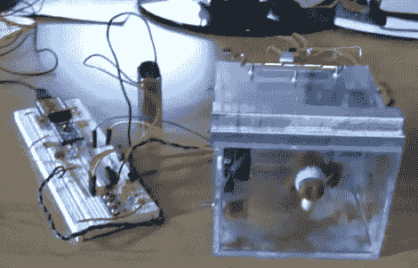

# 初学者概念:电子盒子里的杰克

> 原文：<https://hackaday.com/2010/04/05/beginner-concepts-electronic-jack-in-the-box/>

请看[电子盒中杰克](http://jeremyblum.com/2010/04/03/arduino-powered-jack-in-the-box-toy/)。打开盖子或者输入错误的密码，你就会触发警报。但是如果你用三个按钮输入了正确的 6 个密码，你会得到一首小曲和杰克(住在盒子里)的外观。[Jeremy Blum]设计了这个，作为他在康乃尔大学快速原型课程的[介绍的一部分。休息后看他对项目的描述。](http://www.infosci.cornell.edu/courses/courses.asp?cnumber=INFO%204320)

当他与我们分享这个链接时，他提到这对初学者来说可能是一个有趣的项目，我们完全同意。使用提供的[原理图](http://jeremyblum.com/wp-content/uploads/2010/04/02-BLUM-DESIGN-Jack-in-the-Box-schematic.png)很容易理解这个设计。源代码包包括 PDF 文件，这些文件包含注释良好的代码段及其描述。您可以使用它来熟悉使用 Arduino 驱动扬声器和伺服电机，以及读取两种不同类型的输入。我们特别感兴趣的是为检测盖子是否合上的开关实现的硬件去抖。如今，软件去抖几乎成了标准，但由于使用外部中断来读取开关，这种方法在这里行不通。

如果你有一个 Arduino 和一些组件，为什么不试试呢？

[https://www.youtube.com/embed/Z70TRaKqUbs?version=3&rel=1&showsearch=0&showinfo=1&iv_load_policy=1&fs=1&hl=en-US&autohide=2&wmode=transparent](https://www.youtube.com/embed/Z70TRaKqUbs?version=3&rel=1&showsearch=0&showinfo=1&iv_load_policy=1&fs=1&hl=en-US&autohide=2&wmode=transparent)