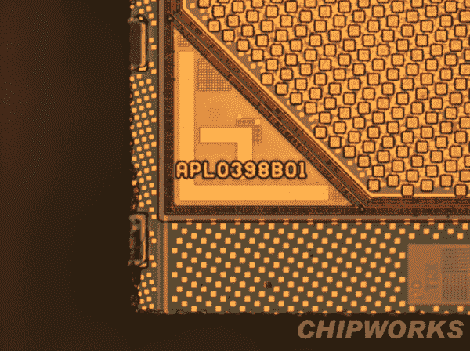

# 窥视 A4，IPad 的大脑

> 原文：<https://hackaday.com/2010/04/06/peering-in-a-the-a4-the-ipads-brain/>

当然，拆开设备看看里面有什么组件很有趣。但是拆卸组件本身更有趣。iFixit [送走了他们的 iPad 内脏暴露在外](http://www.ifixit.com/Teardown/Apple-A4-Teardown/2204/1)在他们完成了[他们的 iPad 拆卸](http://hackaday.com/2010/04/03/ipad-teardown/)之后。我们在过去已经看到了剥离芯片的图片，但是芯片工厂为 iFixit 所做的工作非常惊人。从他们的分析中提供的包装标记和模具照片中，获得几乎每个部件的细节。

[iPad 已经扎根](http://www.pcworld.com/article/193506/browser_exploit_brings_jailbreak_to_the_ipad.html)，但如果你知道你在用什么工作，你永远不知道能释放出什么力量。我们正在考虑 50 兆赫到[100 兆赫示波器黑客](http://hackaday.com/2010/03/31/update-50mhz-to-100mhz-scope-conversion/)。