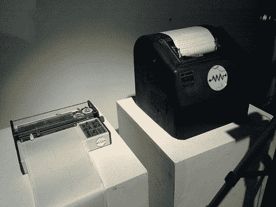

# 电传推特前端

> 原文：<https://hackaday.com/2010/04/07/teletype-twitter-frontend/>

纽约电阻器公司的人得到了一台电传打字机，并入侵它来监控 Twitter。这只 80 岁的怪兽以 45.45 波特的速度发出信息。这不是一个[将东西变成电传打字机](http://hackaday.com/2010/02/11/teletype-machine-from-an-electric-typewriter/)的项目，而是找到一种不同的方式来输入机器数据。在这种情况下，python 脚本解析 Twitter 并将找到的数据发送到 Arduino 板。Arduino 进而将消息格式化为与设备通信所需的串行格式。在左侧，您可以看到一个趋势绘图仪，休息后在视频中了解更多信息。

[谢谢詹姆斯]