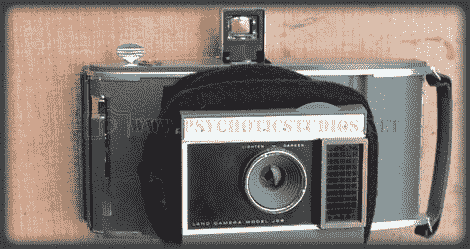

# 将 60 年代早期的宝丽来转变成现代电影

> 原文：<https://hackaday.com/2010/04/11/convert-an-early-60s-polaroid-to-modern-film/>

[亚当]送来这个很酷的项目。他改装了一台宝丽来 J66 相机，使用现代胶片。大多数最初的修改看起来相当简单，但当他们把它转换成完全手动的相机时，事情变得有点复杂。有一节解释了一个巧妙的小技巧，用一个便宜的太阳能电池板连接到你的计算机声卡上来计算相机拍摄的 ISO。