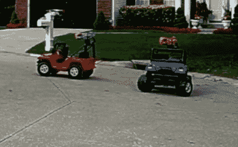

# 疣猪激光标签

> 原文：<https://hackaday.com/2010/04/12/warthog-laser-tag/>

《光环》中的疣猪是最受欢迎的视频游戏车辆之一。[蒂姆·希金斯]用他的[激光标记疣猪游戏](http://www.waterhobo.com/blogengine.net/post/2009/11/15/WiFi-Warthogs.aspx)给生活带来了乐趣。它使用芭比动力轮玩具作为基础，并增加了激光标签武器。使用了 Xbox 360 控制器，但就像在《光环》中一样，你无法同时控制枪支和车辆。我们以前遇到过[蒂姆]对[水上娱乐](http://hackaday.com/2007/10/12/computer-controlled-lawn-defender/)的热爱，这确实始于一个由挡风玻璃洗涤器蓄水池提供动力的水炮。

休息过后，看看视频以及他最近的帖子了解硬件信息。他对控制器电路的选择过于强大，采购 Eee PC 来完成繁重的工作。这是因为他所做的选择是为了易于开发，而不是为了节省部件。PC 连接 Xbox 360 控制器没有问题，模块化控制板意味着不需要复杂的电路设计或费力的焊接。最后，这看起来很有趣，我们给他重新刷了漂亮的粉红色塑料，这是这些儿童玩具模型的标准。

 <https://www.youtube.com/embed/pvhLJexOwaY?version=3&rel=1&showsearch=0&showinfo=1&iv_load_policy=1&fs=1&hl=en-US&autohide=2&wmode=transparent>

 
整个开发过程中项目的幻灯片放映
 <iframe class="youtube-player" width="800" height="480" src="https://www.youtube.com/embed/sJDjQKR0kpg?version=3&amp;rel=1&amp;showsearch=0&amp;showinfo=1&amp;iv_load_policy=1&amp;fs=1&amp;hl=en-US&amp;autohide=2&amp;wmode=transparent" allowfullscreen="true" style="border:0;" sandbox="allow-scripts allow-same-origin allow-popups allow-presentation"/> 
成品系统的演示
 
[谢谢蒂姆]
 </body> </html>