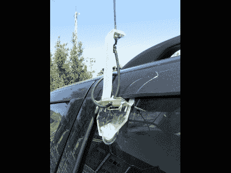

# 为你的汽车安装一个安装在窗户上的天线

> 原文：<https://hackaday.com/2010/04/12/building-a-window-mounted-antenna-for-your-car/>

如果你喜欢业余无线电，并想在外出时使用它[试试这个天线支架](http://cirictech.com/?p=213)。[Cirictech]从 2009 年 11 月的《QST》杂志[的一个设计开始，并加入了他自己的制作。除了天线本身之外的所有东西都可以从五金店买到，只需几美元，您应该可以在瞬间完成这个项目。这让我们想知道](http://www.arrl.org/qst/?month=11&year=2009#toc) [47 GHz 波段无线电设置](http://hackaday.com/2010/04/02/your-hard-drive-needs-a-diamond-blade/)的天线会是什么样子。