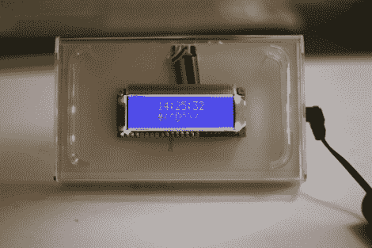

# 时钟隐藏时间，直到你靠近

> 原文：<https://hackaday.com/2010/04/15/clock-hides-time-until-youre-in-close-proximity/>

[Alan]正通过这个时钟扩展到 Arduino 之外。他仍然使用相同的代码，但围绕 ATmega328 和他需要的组件构建了这个板，保留了他的 Arduino 板以供进一步开发。这个概念使用了一个装在旧 iPod Touch 外壳中的字符显示器。该建筑依靠红外传感器来启动 LCD 背光。你的手越近，光越亮。

Maxim DS3232 RTC 芯片在这种应用中保持时间。我们已经在之前见过这个小奇迹，它之所以流行是因为它使用温度补偿来保持精度。如果你对这部分感兴趣，可以看看[Alan]为它写的库文件。