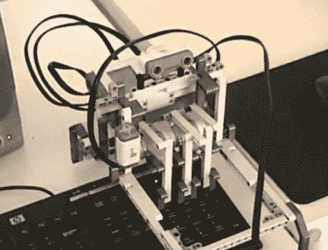

# 思维风暴为你播放俄罗斯方块

> 原文：<https://hackaday.com/2010/04/15/mindstorm-plays-tetris-for-you/>

显然你现在有太多的黑客工作要做，但是俄罗斯方块这个游戏是不会自己玩的。[布拉尼斯拉夫·基萨卡宁]有没有给他的[玩俄罗斯方块的机器人](http://www.youtube.com/watch?v=wY83EaE7svA)盖上被子，这个机器人是用乐高思维风暴积木组装的。设置实际上相当复杂。德州仪器 DM6437 视频开发板通过网络摄像头观察计算机屏幕，并计算下一步行动。然后，它输出到一个 led 网格，Mindstorm 使用一个光传感器来观察。休息后看看它的实际运行情况，然后花点时间看看我们的[其他](http://hackaday.com/2009/06/03/gesture-controlled-tetris/) [各种](http://hackaday.com/2009/07/16/cnc-tetris-theme/) [俄罗斯方块](http://hackaday.com/2010/01/14/avr-tetris/) [基础](http://hackaday.com/2010/01/18/more-avr-tetris/) [黑客](http://hackaday.com/2010/02/16/the-mini-markade/)。

 <https://www.youtube.com/embed/wY83EaE7svA?version=3&rel=1&showsearch=0&showinfo=1&iv_load_policy=1&fs=1&hl=en-US&autohide=2&wmode=transparent>

 </body> </html>