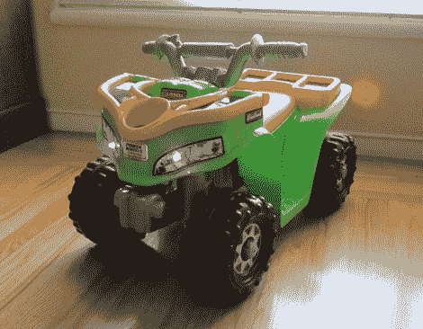
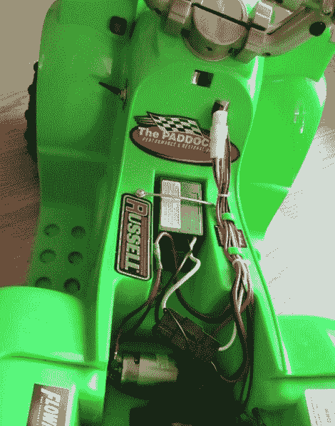
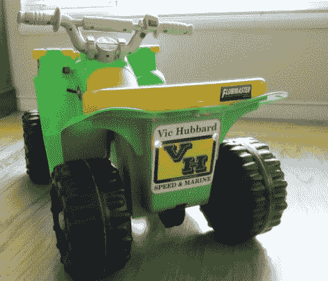

# 改进电动玩具

> 原文：<https://hackaday.com/2010/04/17/improving-a-motorized-toy/>

[Dan Fruzzetti 的]女儿很高兴从她的祖父母那里得到一辆机动车，但[Dan]对普通的特征不感兴趣。铅酸电池在充电之间提供了非凡的寿命，但车辆只有一个功能:一个将电力输送到双极电机的 go 按钮。休息之后，我们将看看他对传动系统、转向和装饰的改进。

在打开顶部舱口后，他接上了一个双刀双掷开关，可以反转马达的极性。这样，方向盘左侧的开关可以从前进档切换到倒档。开关上方的红色小按钮控制着他加入混音的喇叭。虽然这里没有画，他在转向柱上做了一些工作，以增加方向盘的旋转限制，这提高了转向和转向的能力。

最后的修饰更具装饰性。上面的照片显示了尾灯增加了两个红色发光二极管，在顶部，你可以看到发光二极管添加到前灯的贴花上。[丹]的改进花费很少，但它们让这个[动力轮](http://hackaday.com/2010/04/12/warthog-laser-tag/)的仿制品对他的女儿来说更有趣。