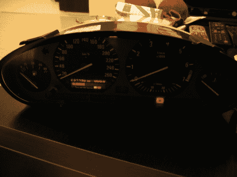

# 带有真实汽车零件的模拟赛车

> 原文：<https://hackaday.com/2010/04/18/racing-sim-with-real-car-parts/>

[Alex Rosiu]从一辆 1992 年的宝马上找到了这个仪表组。经过一些试验和错误之后，他把它和赛车模拟器连接起来使用。你可以在休息后的视频中看到它是多么的令人惊讶。Arduino Mega 接收来自 PC 的输入数据，并启动模块上的相应指示灯。[亚历克斯]没有就此打住。他的手放在满满的仪表板上，正在给[安装一个操纵杆作为 H 档](http://hrsim.blogspot.com/2010/04/joystick-cruelty.html)。请关注这款游戏，我们认为它有一天会成为[一款成熟的运动模拟器](http://hackaday.com/2009/12/21/four-generations-of-motion-simulators/)。

[https://www.youtube.com/embed/bDhWUjw0pA0?version=3&rel=1&showsearch=0&showinfo=1&iv_load_policy=1&fs=1&hl=en-US&autohide=2&wmode=transparent](https://www.youtube.com/embed/bDhWUjw0pA0?version=3&rel=1&showsearch=0&showinfo=1&iv_load_policy=1&fs=1&hl=en-US&autohide=2&wmode=transparent)

[感谢 Nikescar]