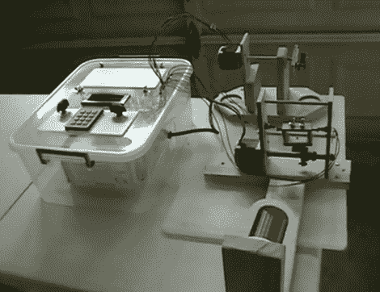

# 自动化吉他拾音器卷绕

> 原文：<https://hackaday.com/2010/04/20/automated-guitar-pickup-winding/>

[Robert Pickering]与我们分享他的[自动吉他拾音器绕线机](http://www.youtube.com/watch?v=fZyDzfw_Rvc)。他为自己在老自治领大学的高年级项目建造的。两个步进电机用于将电磁线缠绕在拾音器硬件上。该单位是 PIC 的基础上，约六分钟到视频(嵌入后休息)，你可以看到，他使用了电线包装这一建设。奇怪的是，在[我们最新的黑客链接](http://hackaday.com/2010/04/18/hackaday-links-april-18-2010/)上有一条评论提到绕线已经很少使用了，但不管怎样，它还是出现了。

我们尤其喜欢他在横向机构上使用的限位开关。车厢两侧都有瞬时按钮，当车厢两侧的干墙螺钉碰到它们时，按钮就会被按下。这使得校准非常容易，因为只需用一点螺丝刀就可以升高或降低螺钉。很好地建立和记录，我们相信他会得到一些高分。

 <https://www.youtube.com/embed/fZyDzfw_Rvc?version=3&rel=1&showsearch=0&showinfo=1&iv_load_policy=1&fs=1&hl=en-US&autohide=2&wmode=transparent>

 
[谢谢胡安]
 </body> </html>