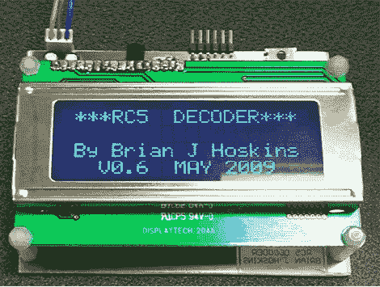

# 红外传输解码

> 原文：<https://hackaday.com/2010/04/21/infrared-transmission-decoding/>

好了，同学们，安静下来，把书翻到曼彻斯特编码那一章。[Brian J Hoskins]在构建这个[RC5 解码器](http://www.brianhoskins.co.uk/rc5decoder.htm)时就是这么做的。该协议通常用于电视遥控器。你每天都在使用它们，难道你不认为是时候了解发生了什么吗？看看他的文章，学习不可见光通信的黑暗艺术。或者直接跳过学习，[跟着我们的方法](http://hackaday.com/2008/10/30/how-to-usb-remote-control-receiver/)。

[谢谢蒂姆]