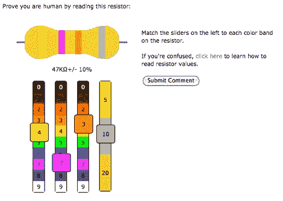

# 你是人类吗？电阻版

> 原文：<https://hackaday.com/2010/04/21/are-you-human-resistor-edition/>

[PT]向我们透露了一种新的方法来屏蔽自动留下评论的机器人。resistance 就像 CAPTCHA，但它要求你破译电阻上的色带，而不是乱码。这对[数字化书籍](http://hackaday.com/2009/09/18/are-you-human-then-type-out-this-book/)的事业没有多大帮助，但是如果你永远记不住你的颜色代码，这是[练习](http://hackaday.com/2010/01/15/know-your-resistors-tell-the-time/)的一个好方法。Resisty 是 WordPress 的一个插件，把它添加到你的博客中，可以获得一个 geek cred +1。