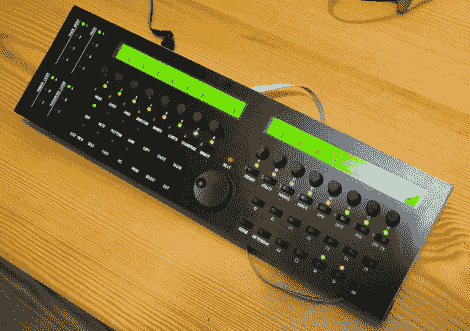

# 认真构建一个序列器

> 原文：<https://hackaday.com/2010/04/22/get-serious-about-building-a-sequencer/>

这是[第四代 MIDIbox 音序器](http://ucapps.de/midibox_seq.html)，它有几个屏幕长的特性集。休息之后，我们嵌入了这部 16 首歌曲的预告视频。您可以通过传统的 MIDI 连接或 USB 使用它。独立的以太网功能也在开发中。这是[完全记录的](http://ucapps.de/midibox_seq_manual.html)，如果你够勇敢，你可以蚀刻自己的 PCB，但如果你必须拥有其中一个，加入[PCB 集团购买](http://www.midibox.org/dokuwiki/doku.php?id=wilba_mb_seq_pcb_bulk_order)可能会更容易。没有什么万能的工具，但是一旦你的烙铁冷却下来，那只会让成功的滋味更加甜蜜。

<https://player.vimeo.com/video/3046696>

 
[谢谢胡安]
 </body> </html>