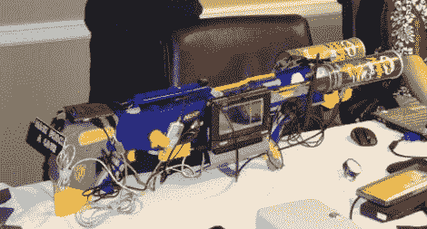

# WiFi 和蓝牙嗅探步枪

> 原文：<https://hackaday.com/2010/04/23/wifi-and-bluetooth-sniffing-rifle/>

[.ronin]建了一个[一体化的 WiFi 和蓝牙嗅探器](http://www.hackfromacave.com/articles_and_adventures/building_vera-ng.html)。他以一支 Nerf 步枪为基础，添加了两个品客薯片罐、一台平板电脑和其他各种各样的零件，将所有这些结合在一起。现在他在街上闲逛，向困惑的路人解释这个装置。在[于 2010 年在 CarolinaCon】展示了这款设备之后(这是他的演示文稿](http://www.hackfromacave.com/articles_and_adventures/carolinacon2010.html)的 [PDF 文档)，他在商场停下来用](http://www.google.com/url?sa=t&source=web&ct=res&cd=6&ved=0CCMQFjAF&url=http%3A%2F%2Fwww.hackfromacave.com%2Fpublications%2FVERA-NG_CarolinaCon2010.pdf&rct=j&q=vera-ng&ei=uWXQS8-HL4iSNrPopfYP&usg=AFQjCNHjKC9wvJefxd_jL1Lk1qH_jtfCMw&sig2=Nu4LP5MD16BReBFZa1Cd3A) [SpoofTooph](http://www.hackfromacave.com/projects/spooftooph.html) 啃了大约 250 个蓝牙设备。该软件运行在富士通 u810 平板电脑上，在他的无线冒险中，他很好地利用了[回溯 4](http://hackaday.com/2009/07/02/crack-wep-using-backtrack/) 。